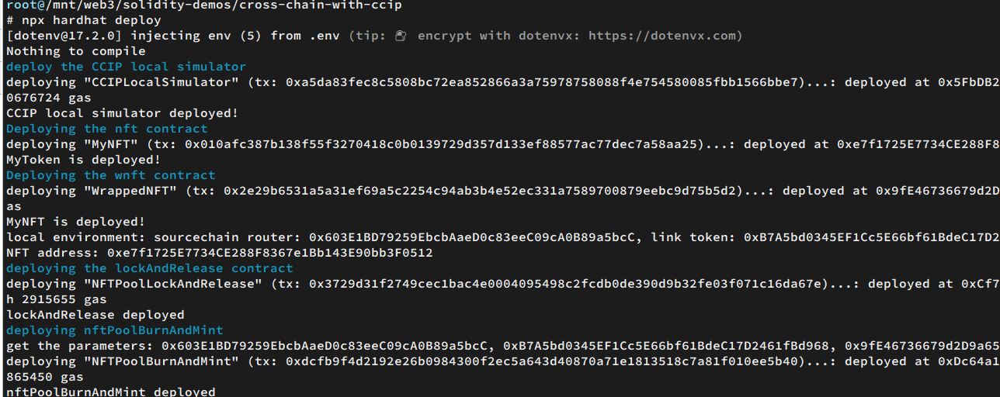

# Sample Hardhat Project

This project demonstrates a basic Hardhat use case. It comes with a sample contract, a test for that contract, and a Hardhat Ignition module that deploys that contract.

Try running some of the following tasks:

```shell
npx hardhat help
npx hardhat test
REPORT_GAS=true npx hardhat test
npx hardhat node
npx hardhat ignition deploy ./ignition/modules/Lock.js
```

# version 

chainlink-contracts: [1.4.0](https://github.com/smartcontractkit/chainlink-evm/tags)

# Effects

## run a RWA demo

chainlink RWA demos:

https://cll-devrel.gitbook.io/mandarin-tokenized-rwa-bootcamp-sep-oct-2024/

```
npx hardhat run scripts/deploy-RealEstateToken.js --network fuji  
npx hardhat run scripts/rwa-deploy-Issuer.js --network fuji 
```

After deployed, do

```
$ npx hardhat set-issuer --tokenaddr 0x9C406980106d46c21b7953Fd3A5279fE62FF80ea --issueraddr 0xcE8C2291733071ecA5439A9F57F8285Cebe24b92 --network 
fuji
[dotenv@17.2.0] injecting env (7) from .env (tip: 🔐 prevent building .env in docker: https://dotenvx.com/prebuild)
signer: 0xA4a8dcE9F35C75f57dF0449B0543Cd767BeF6305
token total supply:0, setIssuer done
```

## run a deployed VRF20 contract

For this contract, I have made random request on Remix, so here it will return `Already rolled` error

```
$ node scripts/query-vrf.js 0xb64B94188E5143156C113601AE2af9cB20C45a29
[dotenv@17.2.0] injecting env (5) from .env (tip: ⚙️  enable debug   
logging with { debug: true })
owner is 0xA4a8dcE9F35C75f57dF0449B0543Cd767BeF6305
Error: execution reverted: "Already rolled" (action="estimateGas", data="0x08c379a00000000000000000000000000000000000000000000000000000000000000020000000000000000000000000000000000000000000000000000000000000000e416c726561647920726f6c6c6564000000000000000000000000000000000000", reason="Already rolled", transaction={ "data": "0xdd02d9e5000000000000000000000000a4a8dce9f35c75f57df0449b0543cd767bef6305", "from": "0xA4a8dcE9F35C75f57dF0449B0543Cd767BeF6305", "to": "0xb64B94188E5143156C113601AE2af9cB20C45a29" }, invocation=null, revert={ "args": [ "Already rolled" ], "name": "Error", "signature": "Error(string)" }, code=CALL_EXCEPTION, version=6.15.0)
    at makeError (E:\workspace\web3\solidity-demos\cross-chain-with-ccip\node_modules\ethers\lib.commonjs\utils\errors.js:137:21)
```

## run nft-via-ccip demo: deploy locally

